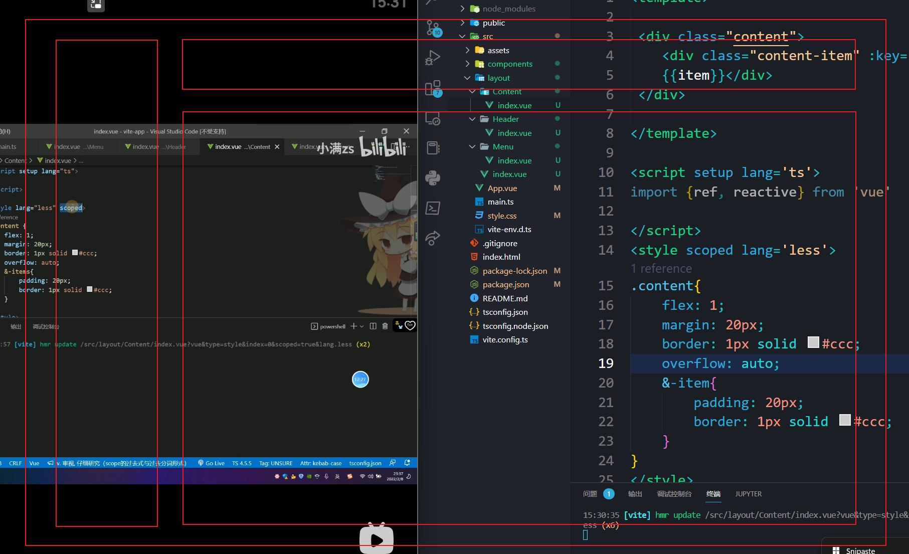
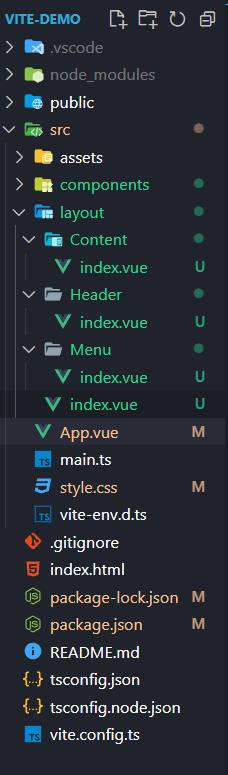
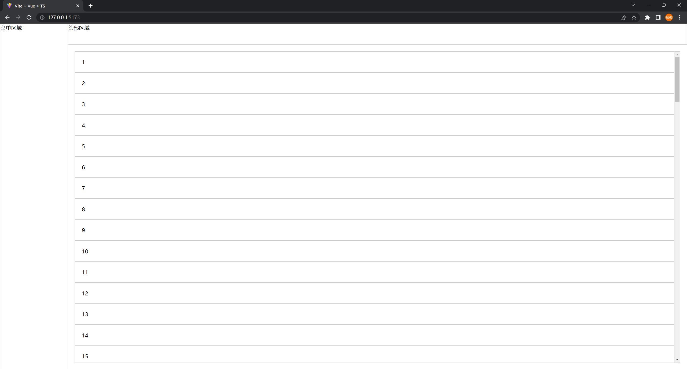

# Vue 笔记

> 学习进度： 第四节 2022/10/05
>
> ​				  第七节 2022/10/06
>
> ​				  第十一节 2022/10/07
>
> ​				  第十六节 2022/10/08
>
> ​				  第二十八节 2022/10/09
>
> ​				  第三十一节 2022/10/10 （未看完）

## Vue 初识

### 基础配置

+ 安装nodejs
+ 安装nvm

对于基础配置的安装，通过手动安装比较麻烦，如果是windows用户，更加推荐使用包管理工具下载，不用配置环境

### 构建项目

+ 简易项目构建

```bash
npm init vite@latest # 项目构建

cd "项目目录"
npm install && npm i # 下载依赖

npm run dev # 启动项目
```

+ 完整项目构建

```bash
npm init vue@latest # 项目构建

cd "项目目录"
npm install && npm i # 下载依赖

npm run dev # 启动项目
```

###  代码学习

#### 模板语法 & vue 指令

##### 模板插值语法

> error: 使用el表达式的时候无法获取数据

在script 声明一个变量可以直接在template使用，用法：{{ 变量名称 }}

```vue
<template>
	<div>
        {{ message }}
    </div>
</template>

<script setup lang="ts">
const message = "Luke Tebo"
</script>

<style>

</style>
```

模板语法的妙用

```vue
<template>
	<div>
        {{ message == 0 ? "Luke" : "Tebo" }}  // 条件运算
        {{ message + 1 }} // 算数运算
        {{ arr.split(',') }}   // 函数调用

</template>

<script setup lang="ts">
    const message:number = 1
    const arr:string = "Luke, Tebo"
</script>

<style>
</style>
```


##### 指令

v- 开头都是vue 指令

v-text 用来显示文本

v-html 用来显示富文本

```vue
<template>
	<div v-text="message"></div>
	<div v-show="code"></div>
</template>

<script setup lang="ts">
    const message:string = "message"
    const code:string = "<h1>code</h1>"
</script>

<style>
</style>
```


v-if 用来控制元素的显示隐藏

v-show 用于控制元素得到显示隐藏

v-if 可以触发创建和销毁的钩子函数

v-show不可以

```vue
<template>
	<div v-if="flag"> // v-if 更加消耗性能，v-if会注释这段代码
        v-if
    </div>
	<div v-show="flag"> // v-show 会通过调整css 来实现隐藏的效果
        v-show
    </div>
</template>

<script setup lang="ts">
const flag:boolean = true
    
</script>

<style>

</style>
```


v-on 简写`@`用来给元素添加事件 => 事件有哪些？

```vue
<template>
	<div>
        <button @click="clickTap">
            123
    </button>
    </div>
</template>

<script setup lang="ts">
const clickTap = () => {
    console.log("click")
}
</script>
<style></style>
```

阻止冒泡事件

```vue
<template>
	<div @click="parent">
        <button @click="clickTap"> 123 </button>
        // 仔细比较 两个按钮在控制台的输出 类似操作较多可自行实践
        <button @click.stop = "clickTap"> 321 </button>
    </div>
</template>

<script setup lang="ts">
const clickTap = () => {
    console.log("click");
}
const parent = () => {
    console.log("parent");
}
</script>
```

阻止表单提交，刷新页面

```vue
<template>
	<form action="/">
		// 不刷新 有啥好处吗？
		<button @click.prevent="submit" type="submit"> submit </button>
		// 刷新
		<button @click="submit" type="submit"> submit_ </button>
	<form>
</template>

<script setup lang="ts">
const submit = () => {
	console.log("child")
}
</script>

<style></style>
```


v-bind 简写`: `用来绑定元素的属性attr

案例1

```vue
<template>
	<div :class="[flag ? "a" : "b"]> luke tebo  </div>
</template>

<script setup lang="ts">
const flag: boolean = false
</script>

<style>
.a {
color: red;
}

.b {
color: blue;
}
</style>
```

案例2

```vue
<template>
  <div :class="flag">{{ flag }}</div>
</template>
 
<script setup lang="ts">
type Cls = {
  other: boolean,
  h: boolean
}
const flag: Cls = {
  other: false,
  h: true
};
</script>
 
<style>
.active {
  color: red;
}
.other {
  color: blue;
}
.h {
  height: 300px;
  border: 1px solid #ccc;
}
</style>
```

v-bind 绑定style

```vue
<template>
  <div :style="style">2222</div>
</template>
 
<script setup lang="ts"> 
type Style = {
  height: string,
  color: string
}
const style: Style = {
  height: "300px",
  color: "blue"
}
</script>
 
<style>
</style>
```


v-for 遍历

有key 和 无key 有区别

```vue
<template>
	<div :key="item" v-for = "item in Arr">{{ item }}</div>
</template>

<script setup lang="ts">
const arr:Array<number[]> = [1, 2, 3, 4, 5]
</script>

<style></style>
```


v-model 双向绑定

> ref ? 是啥

```vue
<template>
  <input v-model="message" type="text" />
  <div>{{ message }}</div>
</template>
 
<script setup lang="ts">
import { ref } from 'vue'
const message = ref("v-model 双向绑定")
</script>
 
<style>

</style>
```

#### 虚拟Dom 和 diff算法

> 没搞明白

#### ref 全家桶  

> ref isRef shallowRef triggerRef  customRef 
>
> 将元素变成响应式

*tips: vscode 配置 vue 模板输出*

> 打开vscode 右键设置 -> 配置用户配置用户代码片段
> 搜索 vue 
>
> ```json
> {
>      "Print to console": {
>     "prefix": "vue3",
>     "body": [
>       "<template>",
>       "",
>       " <div></div>",
>       "",
>       "</template>",
>       "",
>       "<script setup lang='ts'>",
>       "import {ref, reactive} from 'vue'",
>       "",
>       "</script>",
> 
>       "<style scoped>",
>       "",
>       "</style>"
>     ],
>     "description": "Log output to console"
>   }
> }
> ```
>
> 然后在代码界面 敲vue3 就可以出现模板

##### ref 使用 

```vue
<template>
	<div>
        {{ Man }}
        <button @click="change">change</button>
    </div>
</template>
<script setup lang="ts">
import {ref} from 'vue'
// 第一种方式 自己做类型推导
const Man = ref({name: "Luke"})
const change = () => {
	man.value.name = "Tebo"
    console.log(man)
}
// 第二种方式 适用于类型较简单
type M = {
    name: string
}
const Man = ref<M>({name: "Luke"})
// 第三种方式 类型比较复杂的时候，可以使用
import type {Ref} from 'vue'
const Man:Ref<M> = ref({name: "Luke"})
</script>
<style scoped>

</style>
```

##### isRef 使用

```vue
<template>
	<div>
        {{ Man }}
    </div>
<button @click="change">change</button>

</template>
<script setup lang="ts">
    import {ref, isRef} from 'vue'
    const Man = ref({name: "Luke"})
    
    const change = () =》 {
        // 判断是否是Ref 对象
		console.log(isRef(Man))
    }
</script>
<style scoped>

</style>
```

##### shallowRef 使用

```vue
<template>
	<div>
        {{ Man }}
    </div>
<button @click="change">change</button>
</template>
<script setup lang="ts">
 import {ref, shallowRef} from 'vue'

 // 切记 ref 和 shallowRef 不能够混用  具体看下一个混用代码
const Man = shallowRef({name: "Luke"})

const change = () => {
    Man.value.name = "Tebo"
    // 这时会发现 当点击按钮的时候 页面并没有改变，但是console中的值却改变了，这就是ref和shallowRef的区别
    // 在triggerRef 当中会有简单介绍
    console.log(Man)
}
</script>
<style scoped>

</style>
```

##### 混用

```vue
<template>
	<div>
        {{ Man }}
    </div>
<button @click="change">change</button>
</template>
<script setup lang="ts">
 import {ref, shallowRef} from 'vue'

const Man_ = ref({name: "ref"})
const Man = shallowRef({name: "shallowRef"})

const change = () => {
    Man_.value.name = "Tebo"
    Man.value.name = "Tebo"
	// 当两个混用的时候，你点击按钮，会发现原本不变的shallowRef也会变成Tebo， 所以这两个不能混用
    console.log(Man)
}
</script>
<style scoped>

</style>
```

##### triggerRef 使用

```vue
<template>
	<div>
        {{ Man }}
    </div>
<button @click="change">change</button>
</template>
<script setup lang="ts">
 import {ref, shallowRef} from 'vue'

const Man = shallowRef({name: "shallowRef"})

const change = () => {   
    Man.value.name = "Tebo"
    triggerRef(Man) // 当调用这函数的时候，会发现也页面也会跟着改变
 	/*
 	这是因为在vue源码的底层实现的，当调用ref的时候也会调用该函数，所以，ref和shallowRef混用就会导致
 	shallowRef 页面也被刷新
 	*/
    console.log(Man)
}
</script>
<style scoped>

</style>
```

##### customRef使用

```vue
<template>
	<div>
        {{ obj }}
    </div>
<button @click="change">change</button>
</template>
<script setup lang="ts">
import {customRef} from 'vue'
   
// 看不懂     大概就是自己定义一个ref对象吧
// 自己定义的一个方法 也能够实现ref的效果
function MyRef<T>(value: T) {
    let timer: any
    return customRef((track, trigger) => {
        return {
            get() {
                return value
            },
            set(newVal) {
                // 防抖
                clearTimeout(timer)
                timer = setTimeout(() => {
                    console.log("what")
                    value = newVal
                    timer = null
                    trigger()
                }, 500)
            }
        }
    })
}
    
const obj = MyRef<string> ('customRef : Luke')

const change = () => {
    obj.value = 'customRef: Tebo'
    
}
</script>
<style scoped>

</style>
```

##### ref的妙用 ----->  通过ref获取网页元素对象

```vue
<template>
// 类似于 id class
<div ref="dom">
    i am dom
    </div>
<button @click='find'>find</button>
</template>
<script setup lang="ts">
import {ref} from 'vue'

const dom = ref<HTMLElement>()

const find = () => {
    console.log(dom.value?.innerText) // 获取界面元素
}

</script>
<style scoped>

</style>
```

#### reactive 全家桶

>将元素变成响应式

与ref的区别

| 功能       | ref          | reactive                             |
| ---------- | ------------ | ------------------------------------ |
| 支持类型   | 支持所有类型 | 支持引用类型 Array, Object, Map, Set |
| 取值，赋值 | 需要.value   | 不需要.value                         |

##### reactive 绑定表单元素

```vue
<template>
<div>
    <form>
   		<input v-model="form.name" />
    	<br />
    	<input v-model="form.age" />
   	 	<br />
    	<button @click="submit">submit</button>      
    </form>
    </div>
</template>
<script setup lang="ts">
import { reactive } from 'vue'

let form = reactive({
    name: "Luke",
    age: 18
})
const submit = () => {
    console.log(form);
}

</script>
<style scoped>

</style>
```

##### reactive 绑定数组

```vue
<template>
<div>
    <ul>
        <li v-for="item in list">
    			 {{ item }}
    	</li>
    </ul>
    <button @click="add">add</button>
</div>
</template>
<script setup lang="ts">
import { reactive } from 'vue'
    
let list = reactive<string[]>([])

const add = () => {
    list.push("Luke")
}

</script>
<style scoped>

</style>
```

##### reactive 绑定数组 （异步）

```vue
<template>
<div>
    <ul>
        <li v-for="item in list">
    			 {{ item }}
    	</li>
    </ul>
    <button @click="add">add </button>
    <ul>
        <li v-for="item in list_">
    			 {{ item }}
    	</li>
    </ul>
    <button @click="add_">add </button>
</div>
</template>
<script setup lang="ts">
import { reactive } from 'vue'
// 第一种方法
 /*
数组 通过push 加 解构的方式解决
*/
let list = reactive<string[]>([])

const add = () => {
    // 异步 模拟
    setTimeout(() => {
        let res = ["Lu", "Ke", "Te", "Bo"]
        // 当直接使用 list = res 时，会出现 页面没有改变数据，但是值发生了变化，这是因为破坏了reactive原先的proxy  
        list.push(...res) // 解构  没看懂
        console.log(list)
    }, 200)
}

// 第二种方法 
/*
添加一个对象，将数组作为一个属性 
*/
let list_ = reactive<{
    arr: string[]
}>({
    arr: []
})

const add_ = () => {
    setTimeout(() => {
        let res = ["Lu", "Ke", "Te", "Bo"]
        list_.arr = res
        console.log(res)
    }, 200)
}

</script>
<style scoped>

</style>
```

##### readonly 的使用

```vue
<template>
<button @click="show"> show</button>
<button @click="show_"> show_</button>
</template>
<script setup lang="ts">
import { reactive, readonly } from 'vue'

    let obj = reactive({name: "Luke"})
    const read = readonly(obj)
    // read.name = "Tebo" // 不能赋值
    const show = () => {
        read.name = "Tebo"
        console.log(obj, read)
    }
    const show_ = () => {
        obj.name = "Tebo"
        console.log(obj, read)
    }
    /*
    show和show_两个在页面呈现的方式不太一样
    read 不能改变， 但是会受到原来的obj的影响
    */

</script>
<style scoped>

</style>
```

##### shallowReactive 使用

```vue
<template>
    <div>
       reactive {{ obj_}}
       shallowReactive {{ obj }}
    </div>
    <button @click="edit">edit</button>
    <button @click="edit_">edit_</button>
    <button @click="_edit_">_edit_</button>
</template>

<script setup lang='ts'>
import { ref, reactive, readonly, shallowReactive } from 'vue'
    
const obj_ = reactive({name: "Luke"})

const obj:any = shallowReactive({
    foo: {
        bar: {
            num: 1
        }
    }
})

const edit = () => {
    /*
    改变shallowReactive的值 和ref差不多
    浅层变化 数值发生了变化，但是界面没有被渲染
    */
    obj.foo.bar.num = 333
    console.log(obj)
}

const edit_ = () => {
    /*
    foo就处于浅层 所有通过这个按钮可以实现 页面改变
    */
    obj.foo = {name: "Luke"}
    console.log(edit_)
}

const _edit_ = () => {
    /*
    和shallowref一样 当reactive发生变化的时候，shallowReactive也会改变
    */
    obj_.name = "Vue"
    obj.foo.bar.num =  "what"
    console.log(obj)
}

</script>
<style scoped>

</style> 
```

#### to全家桶

> toRef toRefs toRaw 
>
> 解构是啥？

##### toRef 的使用

> toRef 只针对响应式对象，智能修改响应式对象的值， 对于非响应式对象，视图不会改变，值会改变 

```vue
<template>
<div>
    {{ man }}
    <hr />
    {{ man_ }}
    <hr />
    <button @click="change">edit</button>
    </div>
</template>
<script setup lang='ts'>
import { toRef, reactive, toRefs, toRaw } from 'vue'

const man = {name: "Luke", age: 19, like: "programer"} // 非响应式对象
cosnt man_ = reactive({name: "Luke", age: 19, like: "programer"}) // 响应式对象

const like = toRef(man, "like") // 属性
const like_ = toRef(man, "like")

const change = () => {
	like.value = "play game"
	like_.value = "play game"
	console.log(like, like_)
}

</script>
<style scoped>
</style>                         
```

##### toRefs 的使用

> 适用于解构和赋值 和 toRef有点类似，可以理解为一个复数 `s`

```vue
<template>
<div>
    {{ man }}
    <hr />
    <button @click="change">edit</button>
    </div>
</template>
<script setup lang='ts'>
import { toRef, reactive, toRaw } from 'vue'

cosnt man_ = reactive({name: "Luke", age: 19, like: "programer"}) // 响应式对象

const toRefs = <T extends object>(object: T) => {
	const map:any = {}
	
	for (let key in object) {
		map[key] = toRef(object, key)
	}
	return map
}

const change = () => {
	name.value = "Tebo"
	console.log(name, age, like)
}

</script>
<style scoped>
```

##### toRaw 的使用

```vue
<template>
<div>
    {{ man }}
    <hr />
    <button @click="change">edit</button>
    </div>
</template>
<script setup lang='ts'>
import { toRef, reactive, toRaw } from 'vue'

cosnt man_ = reactive({name: "Luke", age: 19, like: "programer"}) // 响应式对象


const change = () => {
	// Proxy 对象	 object 当不想元素做响应式的时候，可以使用
	// 需要使用google浏览器查看，不知道为什么edge查看的时候是一样的
	console.log(man, toRaw(man))
}

</script>
<style scoped>
```


#### computed 计算属性

简单使用
```vue
<template>
<div>
	<input v-model="firstName" type="text" />
	<input v-model="lastName" type="text" />
	<div>
		{{ firstName }} --- {{ lastName }}
		<hr />
		{{ name }}
		<hr />
		{{ name_ }}
	</div>
</div>
</template>

<script setup lang="ts">
import { ref, reactive, computed } from 'vue'

let firstName = ref("")
let lastName = ref("")

// 写法一
const name = computed(() => {
	return firstName.value + '-----------' + lastName.value
})

// 写法二  需要复现 get 和 set 方法
const name_ = computed(() => {
	get() {
		return firstName.value + lastName.value
	},
	set() {
		firstName.value + lastName.value
	}
})
</script>
<style scoped>
</style>
```

购物车案例

```vue
// 未使用 computed 可以看出，total函数被重复调用，很不方便
<template>

    <div>
        <table border="1px solid red" style="width: 500px">
            <thead>
                <tr>
                    <th>Name</th>
                    <th>Number</th>
                    <th>Price</th>
                    <th>Operate</th>
                </tr>
            </thead>
            <tbody>
                <tr :key="index" v-for="(item, index) in data">
                    <td align="center">{{ item.name }}</td>
                    <td align="center"><button @click="numChange(index, false)">-</button>{{ item.num }}<button
                            @click="numChange(index, true)">+</button></td>
                    <td align="center">{{ item.price * item.num }}</td>
                    <td align="center"><button @click="del(index)">delete</button></td>
                </tr>
            </tbody>
            <tfoot>
                <tr>
                    <td></td>
                    <td></td>
                    <td></td>
                    <td align="center">total: {{total}}</td>
                </tr>
            </tfoot>
        </table>
    </div>
</template>

<script setup lang='ts'>
import { isTemplateNode } from '@vue/compiler-core';
import { ref, reactive, computed } from 'vue'
type Shop = {
    name: string,
    num: number,
    price: number
}

let total = ref(0)

const data = reactive<Shop[]>([
    {
        name: "LV",
        num: 1,
        price: 100
    },
    {
        name: "Nike",
        num: 1,
        price: 300
    },
    {
        name: "sonny",
        num: 1,
        price: 2499
    }
])

const numChange = (index: number, type: boolean) => {
    // -
    if (data[index].num > 0 && !type) {
        data[index].num--
    }
    // + 
    if (type) {
        data[index].num++
    }
    total_()
}

// reduce 函数 不常用 不是很记得
const total_ = () => {
    total.value = data.reduce((prev, next) => {
        return prev + (next.num * next.price)
    }, 0)
}

const del = (index: number) => {
    data.splice(index, 1)
    total_()
}

total_()

</script>
<style scoped>

</style>

-------------------------------------------------------------------

<template>

    <div>
        <table border="1px solid red" style="width: 500px">
            <thead>
                <tr>
                    <th>Name</th>
                    <th>Number</th>
                    <th>Price</th>
                    <th>Operate</th>
                </tr>
            </thead>
            <tbody>
                <tr :key="index" v-for="(item, index) in data">
                    <td align="center">{{ item.name }}</td>
                    <td align="center"><button @click="numChange(index, false)">-</button>{{ item.num }}<button
                            @click="numChange(index, true)">+</button></td>
                    <td align="center">{{ item.price * item.num }}</td>
                    <td align="center"><button @click="del(index)">delete</button></td>
                </tr>
            </tbody>
            <tfoot>
                <tr>
                    <td></td>
                    <td></td>
                    <td></td>
                    <td align="center">total: {{total}}</td>
                </tr>
            </tfoot>
        </table>
    </div>
</template>

<script setup lang='ts'>
import { isTemplateNode } from '@vue/compiler-core';
import { ref, reactive, computed } from 'vue'
type Shop = {
    name: string,
    num: number,
    price: number
}

let total = ref(0)

const data = reactive<Shop[]>([
    {
        name: "LV",
        num: 1,
        price: 100
    },
    {
        name: "Nike",
        num: 1,
        price: 300
    },
    {
        name: "sonny",
        num: 1,
        price: 2499
    }
])

const numChange = (index: number, type: boolean) => {
    // -
    if (data[index].num > 0 && !type) {
        data[index].num--
    }
    // + 
    if (type) {
        data[index].num++
    }
}

total = computed<number>(() => {
    return data.reduce((prev, next) => {
        return prev + (next.num * next.price)
    }, 0)
})

const del = (index: number) => {
    data.splice(index, 1)
}

</script>
<style scoped>

</style>

```

#### watch 侦听器

>watch 

简单操作一

```vue
<template>
    <div>
        	<input v-model="message" type="text" />
    </div>
</template>

<script setup lang='ts'>
import { ref, watch } from "vue"

let message = ref<string>("")

watch(message, (newVal, oldVal) => {
    console.log("new: " + newVal)
    console.log("old: " + oldVal)
})

</script>
<style scoped>

</style>
```

简单操作二

```vue
<template>

    <div>
        	<input v-model="message" type="text" />
        	<input v-model="message_" type="text" />
    </div>
</template>

<script setup lang='ts'>
import { ref, watch } from "vue"

let message = ref<string>("")
let message_ = ref<string>("")

watch([message, message_], (newVal, oldVal) => {
    console.log("new: " + newVal)
    console.log("old: " + oldVal)
})

</script>
<style scoped>

</style>
```

简单操作三

```vue
<template>

    <div>
        	<input v-model="message" type="text" />
    </div>
</template>

<script setup lang='ts'>
import { ref, watch } from "vue"

let message = ref({
    nav: {
        bar: {
            name: "Luke"
        }
    }
})

watch(message,  (newVal, oldVal) => {
    console.log("new: " + newVal)
    console.log("old: " + oldVal)
}, {
    deep: true // 没有这个参数，正常情况下，是无法监听到数据变化的，但是使用这个参数也有问题，且vue官方尚未解决
    /* 
    问题是：当深度监听时，新旧值是一样的，这样很明显不符合要求 
    */
})

</script>
<style scoped>

</style>
```

简单操作四

```vue
<template>
    <div>
        	<input v-model="message.nav.bar.name" type="text" />
    </div>
</template>

<script setup lang='ts'>
import { ref, watch } from "vue"

let message = ref({
    nav: {
        bar: {
            name: "Luke"
        }
    }
})


watch(message, , (newVal, oldVal) => {
    console.log("new: " + newVal)
    console.log("old: " + oldVal)
}, {
    deep: true // 没有这个参数，正常情况下，是无法监听到数据变化的，但是使用这个参数也有问题，且vue官方尚未解决
    /* 
    问题是：当深度监听时，新旧值是一样的，这样很明显不符合要求 
    */
    immediate: true //  一打开页面就会自动监听
})

</script>
<style scoped>

</style>
```

简单操作五

```vue
<template>

    <div>
        	<input v-model="message.name" type="text" />
        	<input v-model="message.name" type="text" />
    </div>
</template>

<script setup lang='ts'>
import { ref, watch } from "vue"

let message = reactive({
  name: "Luke",
  name_: "Tebo"
})

// 监听两个值变化
watch(message,  (newVal, oldVal) => {
    console.log("new: " + newVal)
    console.log("old: " + oldVal)
})
/* 
监听一个值的变化
回调函数用的棒
watch(() => message.name,  (newVal, oldVal) => {
    console.log("new: " + newVal)
    console.log("old: " + oldVal)
})
*/

</script>
<style scoped>

</style>
```

#### watchEffect

简单上手

```vue
<template>
    <input v-model="message" type="text" />
    <br />
    <input v-model="message_" type="text" />


</template>

<script setup lang='ts'>
import { reactive, ref, watch, watchEffect } from "vue"

let message = ref<string>("Luke")

let message_ = ref<string>("Tebo")

watchEffect(() => {
    // 非惰性 自动调用
    /*
    watch 需要打开immeditate才能自动调用，watchEffect比watch勤快
    */
    console.log("message: ", message.value)
    console.log("message_: ", message_.value)
})

</script>
<style scoped>

</style>
```

 ```typescript
 <script setup lang='ts'>
 import { reactive, ref, watch, watchEffect } from "vue"
 
 let message = ref<string>("Luke")
 
 let message_ = ref<string>("Tebo")
 
 watchEffect((oninvalidate) => {
     // 非惰性 自动调用
     console.log("message: ", message.value)
     console.log("message_: ", message_.value)
     // 在侦听之前调用
     oninvalidate(() => { 
          // 在监听之前，执行 可以做一些操作，如防抖，清除接口之类的
         console.log("before") // 但是是值发生变化的时候，才会触发，最开始不会触发
     })
 })
 
 </script>
 ```

```vue
<template>
    <input v-model="message" type="text" />
    <br />
    <input v-model="message_" type="text" />
	<button @click="stopWatch">
        stop
    </button>
</template>

<script setup lang='ts'>
import { reactive, ref, watch, watchEffect } from "vue"

let message = ref<string>("Luke")

let message_ = ref<string>("Tebo")

// 返回一个值，能够停止监听
const stop = watchEffect(() => {
    // 非惰性 自动调用
    console.log("message: ", message.value)
    console.log("message_: ", message_.value)
})

const stopWatch = () => stop() // 实现停止监听

</script>
<style scoped>

</style>
```

```vue
<template>
    <input id="ipt" v-model="message" type="text" />
    <br />
    <input v-model="message_" type="text" />


</template>

<script setup lang='ts'>
import { reactive, ref, watch, watchEffect } from "vue"

let message = ref<string>("Luke")

let message_ = ref<string>("Tebo")

const stop = watchEffect((oninvalidate) => {
    let ipt: HTMLInputElement = document.querySelector("#ipt") as HTMLInputElement
    // 非惰性 自动调用
    console.log(ipt)
    oninvalidate(() => {
        // 在监听之前，执行 可以做一些操作，如防抖，清除接口之类的
        console.log("before");
    })
}, {
    // flush: "post" 当注释这个时 ipt 为null 没有注释ipt在渲染完成后被成功加载 有几种方式
 	
})

const stopWatch = () => stop()
</script>
<style scoped>

</style>
```

|      | sync | post | pre  |
| ---- | ---- | ---- | ---- |
|      |      |      |      |

打开调试工具

```vue
<template>
    <input id="ipt" v-model="message" type="text" />
    <br />
    <input v-model="message_" type="text" />


</template>

<script setup lang='ts'>
import { reactive, ref, watch, watchEffect } from "vue"

let message = ref<string>("Luke")

let message_ = ref<string>("Tebo")

const stop = watchEffect((oninvalidate) => {
    // 非惰性 自动调用
    // console.log("message: ", message.value)
    oninvalidate(() => {
        // 在监听之前，执行 可以做一些操作，如防抖，清除接口之类的
        console.log("before");
    })
}, {
    onTrigger (e) {
        debugger // 调试工具
    }
})

const stopWatch = () => stop()
</script>
<style scoped>

</style>
```

#### 认识组件 & 生命周期

> hook ?  什么是组件

组建的概念：

 

生命周期

| 名称              | 作用     |
| ----------------- | -------- |
| beforeCreate      | 创建之前 |
| Created           | 创建     |
| onBeforeMounted   | 挂载之前 |
| onMounted         | 挂载     |
| onBeforeUpdate    | 更新之前 |
| onUpdated         | 更新     |
| onBeforeUnmount   | 卸载之前 |
| onUnmounted       | 卸载     |
| onRenderTracked   |          |
| onRenderTriggered |          |

*补充*

v-if 和 v-show的区别

v-if 可以触发组件 创建和销毁的钩子，v-show不可以

 ```vue
 <template>
 
  <div> i am a A</div>
  <div>Luke</div>
  <div ref="data">{{ data_ }}</div>
  <button @click="change">edit</button>
  <hr />
 
 </template>
 
 <script setup lang='ts'>
 import { ref, onBeforeMount, onMounted, onBeforeUpdate, onUpdated, onBeforeUnmount, onUnmounted, onRenderTracked, onRenderTriggered} from 'vue'
 
 const data = ref<HTMLDivElement>()
 const data_ = ref<string>('Luke')
 
 const change = () => {
     data_.value = "Tebo"
 }
 
 // beforeCreate created setup 语法糖模式是没有这两个生命周期的 setup去代替
 console.log("setup")
 console.log(data_.value)
 // 挂载  
 // onBeforeMount 读不到dom onMounted 可以去读dom
 onBeforeMount(() => {
     console.log("BeforeMount", data.value)
 })
 onMounted(() => {
     console.log("Mounted", data.value)
 })
 // 更新
 /// onBeforeUpdate 获取更新之前的dom onUpdated 获取更新之后的dom
 onBeforeUpdate(() => { 
     // 针对dom元素吗？
     console.log("BeforeUpdate", data.value?.innerText);
 })
 onUpdated(() => {
     console.log("Updated", data.value?.innerText);
     
 })
 // 卸载
 onBeforeUnmount(() => {
     console.log("BeforeUnmount", data.value);
 })
 onUnmounted(() => {
     console.log("Unmounted", data.value)
 })
 // 调试作用
 onRenderTracked((e) => {
 
 })
 onRenderTriggered((e) => {
 
 })
 </script>
 <style scoped>
 
 </style>
 
 ------------------------------------------------
 
 <template>
     <h1>生命周期</h1>
     <!-- v-if可以触发 组建的创建和销毁 v-show不可以 -->
     <A v-if="flag"></A>
     <button @click="flag = !flag">create -- destroy</button>
 </template>
 
 <script setup lang='ts'>
 import { ref, reactive } from 'vue'
 import A from './components/A.vue'
 
 const flag = ref<Boolean>(false)
 
 </script>
 <style scoped>
 
 </style>
 
 ```

#### 实操组件&认识less和scoped

安装less

> npm install less less-loader -D

less:

scoped:

案例

设计稿



项目结构：



完成结果



layout

```vue
// index.vue
<template>

 <div class="layout">
        <Menu></Menu>
    <div class="layout-right">
        <Header></Header>
        <Content></Content>
    </div>
 </div>

</template>

<script setup lang='ts'>
import {ref, reactive} from 'vue'
import Menu from './Menu/index.vue'
import Header from './Header/index.vue'
import Content from './Content/index.vue'

</script>
<style scoped lang='less'>
.layout{
    display: flex;
    height: 100%;
    overflow: hidden;
    &-right{
        flex: 1;
        display: flex;
        flex-direction: column;
    }
}
</style>
```

```vue
// header
<template>

 <div class="header">头部区域</div>

</template>

<script setup lang='ts'>
import {ref, reactive} from 'vue'

</script>
<style scoped lang='less'>
.header{
    height: 60px;
    border: 1px solid #ccc;
}

</style>
```

```vue
// content
<template>

 <div class="content">
    <div class="content-item" :key="item" v-for="item in 100">
    {{item}}</div>
 </div>

</template>

<script setup lang='ts'>
import {ref, reactive} from 'vue'

</script>
<style scoped lang='less'>
.content{
    flex: 1;
    margin: 20px;
    border: 1px solid #ccc;
    overflow: auto;
    &-item{
        padding: 20px;
        border: 1px solid #ccc;
    }
}
</style>
```

```vue
// menu
<template>

 <div class="menu">菜单区域</div>

</template>

<script setup lang='ts'>
import {ref, reactive} from 'vue'

</script>
<style scoped lang='less'>
.menu{
    width: 200px;
    border: 1px solid #ccc;
}
</style>
```

```vue
// App.vue
<template>
    <layout></layout>

</template>

<script setup lang='ts'>
import { ref, reactive } from 'vue'
import layout from './layout/index.vue'

</script>
<style lang="less">
html, body, #app {
    height: 100%;
    overflow: hidden;
}
</style>
```

```css
<!--style.css-->
html, body, div, span, applet, object, iframe,
h1, h2, h3, h4, h5, h6, p, blockquote, pre,
a, abbr, acronym, address, big, cite, code,
del, dfn, em, img, ins, kbd, q, s, samp,
small, strike, strong, sub, sup, tt, var,
b, u, i, center,
dl, dt, dd, ol, ul, li,
fieldset, form, label, legend,
table, caption, tbody, tfoot, thead, tr, th, td,
article, aside, canvas, details, embed, 
figure, figcaption, footer, header, hgroup, 
menu, nav, output, ruby, section, summary,
time, mark, audio, video {
    margin: 0;
    padding: 0;
    border: 0;
    font-size: 100%;
    font: inherit;
    vertical-align: baseline;
}
/* HTML5 display-role reset for older browsers */
article, aside, details, figcaption, figure, 
footer, header, hgroup, menu, nav, section {
    display: block;
}
ol, ul {
    list-style: none;
}
blockquote, q {
    quotes: none;
}
blockquote:before, blockquote:after,
q:before, q:after {
    content: '';
    content: none;
}
table {
    border-collapse: collapse;
    border-spacing: 0;
}

```

#### 父子组件传参

父组件通过v-bind绑定一个数据，然后子组件通过defineProps接受传过来的值

| 名称         | 作用                       |
| ------------ | -------------------------- |
| defineEmits  | 子组件给父组件传参         |
| defineExpose | 子组件暴露给父组件内部属性 |
| defineProps  | 子组件接受值               |
| withDefaults | 设定默认值                 |

##### 父组件传递参数给子组件案例 

字符串

```vue
// 父组件
<template>
    <div class="layout">
        // 父组件给子组件传递参数 title: string 字符串
        <!-- title 随便取 -->
        <Menu title="Luke Tebo"></Menu>
        <div class="layout-right">
            <Header></Header>
            <Content></Content>
        </div>
    </div>

</template>

<script setup lang='ts'>
import { ref, reactive } from 'vue'
import Menu from './Menu/index.vue'
import Header from './Header/index.vue'
import Content from './Content/index.vue'

</script>
<style scoped lang='less'>
.layout {
    display: flex;
    height: 100%;
    overflow: hidden;
    &-right {
        flex: 1;
        display: flex;
        flex-direction: column;
    }
}
</style>
```

 ```vue
 // 子组件
 <template>
  <div class="menu">
     菜单区域
     <div>
         {{title}}
     </div>
  </div>
 </template>
 
 <script setup lang='ts'>
 import {ref, reactive} from 'vue'
 // 接受父组件传递的值
 type Props = {
     title: string
 }
 defineProps<Props>()
 </script>
 <style scoped lang='less'>
 .menu{
     width: 200px;
     border: 1px solid #ccc;
 }
 </style>
 ```

##### 复杂数据类型

```vue
// 父组件
<template>
    <div class="layout">
        // 父组件给子组件传递参数 list: number[]
		// v-bind:data => :data
        <Menu :data="list"></Menu>
        <div class="layout-right">
            <Header></Header>
            <Content></Content>
        </div>
    </div>

</template>

<script setup lang='ts'>
import { ref, reactive } from 'vue'
import Menu from './Menu/index.vue'
import Header from './Header/index.vue'
import Content from './Content/index.vue'
const list = reactive<number[]>([1, 2, 3])
    
</script>
<style scoped lang='less'>
.layout {
    display: flex;
    height: 100%;
    overflow: hidden;
    &-right {
        flex: 1;
        display: flex;
        flex-direction: column;
    }
}
</style>
```

```vue
// 子组件
<template>
 <div class="menu">
    菜单区域
    <div>
        {{data}}
    </div>
 </div>
</template>

<script setup lang='ts'>
import { stringify } from 'querystring';
import {ref, reactive} from 'vue'
// 接受父组件传递的值
type Props = {
    data: number[]
}
defineProps<Props>()
</script>
<style scoped lang='less'>
.menu{
    width: 200px;
    border: 1px solid #ccc;
}
</style>
```

##### 子组件给父组件传值 => 通过事件来进行参数传递

```vue
// 父组件
<template>
 <div class="layout">
        <Menu @on-click="getList"></Menu>
        <div class="layout-right">
            <Header></Header>
            <Content></Content>
        </div>
    </div>
</template>

<script setup lang='ts'>
import { stringify } from 'querystring';
import {ref, reactive} from 'vue'
// 接收数据
const getList = (list:number[]) => {
    console.log(list);
}
</script>
<style scoped lang='less'>
.menu{
    width: 200px;
    border: 1px solid #ccc;
}
</style>
```

```vue
// 子组件
<template>
 <div class="menu">
    菜单区域
	<button @click="clickTap">send</button>
 </div>
</template>

<script setup lang='ts'>
import { stringify } from 'querystring';
import {ref, reactive} from 'vue'

const list = reactive<number[]>([2, 3, 4])
										// 可以随便命名 defineEmits["on-click", "on-click_", .....]
const emit = defineEmits(['on-click'])
// 发送数据
const clickTap = () => {
    // 同样可以跟多个数据 类似 emit('on-click', a, b, c, .... )
    emit('on-click', list)
}
</script>
<style scoped lang='less'>
.menu{
    width: 200px;
    border: 1px solid #ccc;
}
</style>
```

##### 获取子组件的实例

```vue
// 父组件
<template>
 <div class="layout">
        <Menu ref="menu"></Menu>
        <div class="layout-right">
            <Header></Header>
            <Content></Content>
        </div>
    </div>
</template>

<script setup lang='ts'>
import { stringify } from 'querystring';
import {ref, reactive} from 'vue'
const menu = ref(null)
// 接收数据
const getList = (list:number[]) => {
    console.log(menu.value);
}
</script>
<style scoped lang='less'>
.menu{
    width: 200px;
    border: 1px solid #ccc;
}
</style>
```

```vue
// 子组件
<template>
 <div class="menu">
    菜单区域
	<button @click="clickTap">send</button>
 </div>
</template>

<script setup lang='ts'>
import {ref, reactive} from 'vue'

const list = reactive<number[]>([2, 3, 4])
										// 可以随便命名 defineEmits["on-click", "on-click_", .....]
const emit = defineEmits(['on-click'])
// 发送数据
const clickTap = () => {
    // 同样可以跟多个数据 类似 emit('on-click', a, b, c, .... )
    emit('on-click', list)
}
// 通过这个参数来使子组件中那些属性暴露，在没有使用这个属性的情况下，子组件中的属性不会在父组件中暴露
defineExpose({
    list
})
</script>
<style scoped lang='less'>
.menu{
    width: 200px;
    border: 1px solid #ccc;
}
</style>
```

##### 参数传递是否可选和默认值

```vue
// 父组件
<template>
 <div class="layout">
        <Menu></Menu>
     <!--
<Menu title="Tebo" ></Menu>
<Menu :data="list"></Menu>
	-->
        <div class="layout-right">
            <Header></Header>
            <Content></Content>
        </div>
    </div>
</template>

<script setup lang='ts'>
import {ref, reactive} from 'vue'

</script>
<style scoped lang='less'>
.menu{
    width: 200px;
    border: 1px solid #ccc;
}
</style>
```

```vue
// 子组件
<template>
 <div class="menu">
    菜单区域
	<div>{{ title }}</div>
    <div>{{ data }} </div>
 </div>
</template>

<script setup lang='ts'>
import {ref, reactive} from 'vue'
type Props = {
    // 可选
    title?: string,
    data?: number[]
}

withDefaults(defineProps<Props>(), {
    title:"默认"，
    // 特殊的数据，无法直接赋值，可以通过回调函数返回数据
    data: () => [1, 2, 3, 4]
})

</script>
<style scoped lang='less'>
.menu{
    width: 200px;
    border: 1px solid #ccc;
}
</style>
```

#### 全局组件、局部组件、递归组件

> 第二次遇到el表达式没有起作用

全局组件

在main.ts当中注册，即可在其他文件上面使用

```ts
// main.ts
import Card from './components/Card/index.vue'
createApp(App).component("Card", Card).mount("#app") // 不能搞错顺序，这个是链式调用
```


##### Card 卡片案例

```vue
// components/Card/index.vue

<template>

 <div class="card">
    <div class="card-header">
        <div>主标题</div>
        <div>副标题</div>
    </div>
    <div class="card-content" v-if="content">
        {{ content }}
    </div>
 </div>

</template>

<script setup lang='ts'>
import {ref, reactive} from 'vue'

type Props = {
    content?: string
}

// 接受父组件传值
defineProps<Props>()

</script>
<style scoped lang='less'>
@border: #ccc;
.card{
    border: 1px solid @border;
    &:hover{
        box-shadow: 0 0 10px @border;
    }
    &-header{
        display: flex;
        justify-content: space-between;
        padding: 10px;
        border-bottom: 1px solid @border;
    }
    &-content{
        padding: 10px;
    }
}
</style>
```

局部组件

就相当于引用的

> import A from "......"  这种组件

递归组件

##### Tree 树案例

```vue
// 方案一
// Menu/index.vue  父组件
<template>
    <div class="menu">
        菜单区域
        <Tree :data="data"></Tree>
    </div>
</template>

<script setup lang='ts'>
import { ref, reactive } from 'vue'
import Tree from '../../components/Tree/index.vue'

type TreeList = {
    name: string,
    icon?: string,
    children?: TreeList[] | []
}
const data = reactive<TreeList[]>([
    {
        name: "no.1",
        children: [
            {
                name: "no.1-1",
                children: [
                    {
                        name: "no.1-1-1"
                    }
                ]
            }
        ]
    }, {
        name: "no.2",
        children: [
            {
                name: "no.2-1"
            }
        ]
    }, {
        name: "no.3"
    }
])

</script>
<style scoped lang='less'>
.menu {
    width: 200px;
    border: 1px solid #ccc;
}
</style>
--------------
// tree Tree/index.vue 子组件

<template>

 <div :key="index" v-for="(item, index) in data" style="margin-left:10px">
    {{ item.name }}
    <!-- 递归第一种 -->
     // 读取不到的时候 不会报错而是返回undefined 还有 ?? 语法
    <TreeItem v-if="item?.children?.length" :data="item.children"></TreeItem>

 </div>

</template>

<script setup lang='ts'>
import {ref, reactive} from 'vue'
import TreeItem from './index.vue' // 重复引用

type TreeList = {
    name: string,
    icon?: string,
    children?: TreeList[] | []
}

type Props = {
    data?: TreeList[]
}

defineProps<Props>()

</script>
<!-- 第二种 -->
<script lang="ts"> /// 有时候上面那个data可能会报错，但是能够使用，但是用下面这个不会报错
export default {
    name: "TreeItem"
}
</script>

<style scoped lang='less'>

</style>
```

#### 动态组件

> 什么是动态组件 就是：让多个组件使用同一个挂载点，并动态切换，这就是动态组件
>
> 在挂载点使用component标签，然后使用v-bind:is="组件"

动态组件 案例

```vue
// 主组件

<template>
    <div  class="content">
        <div class="tab">
            <div @click="change(item)" :key="item.name" v-for="item in data">{{ item.name }}</div>
        </div>
        <component :is="current.comName"></component>
    </div>

</template>

<script setup lang='ts'>
import { ref, reactive, markRaw } from 'vue'
import A from './A.vue'
import B from './B.vue'
import C from './C.vue'

type Tabs = {
    name: string,
    comName: any
}

type Com = Pick<Tabs, "comName">

// proxy 
const data = reactive<Tabs[]>([
    {
        name: "I am A",
        // comName: "A"
        comName: markRaw(A) // 跳过代理
    },
    {
        name: "I am B",
        // comName: "B"
        comName: markRaw(B)
    },
    {
        name: "I am C",
        // comName: "C"
        comName: markRaw(C)
    }
])

let current = reactive<Com>({
    comName:data[0].comName
})

const change = (item: Tabs) => {
    current.comName = item.comName
}

</script>
<style scoped lang='less'>
.tab {
    display: flex;
    .active{
        background: skyblue;
        color: #fff;
    }
    div {
        margin: 10px;
        border: 1px solid #ccc;

    }
}
</style>

---------------------------------------------------
// A.vue
<template>

 <div class="a">
    AAAAAAAAAAAAAAAAAAAAA
 </div>

</template>

<script setup lang='ts'>
import {ref, reactive} from 'vue'

</script>
<style scoped lang='less'>
.a{
    background-color: red;
    

}

</style>
------------------------------------------------------
// B.vue
<template>

 <div class="b">
    BBBBBBBBBBBBBBBBBBBB
 </div>

</template>

<script setup lang='ts'>
import {ref, reactive} from 'vue'


</script>
<style scoped lang='less'>
.b{
    background-color: blue;
}
</style>
----------------------------------------------------
// C.vue
<template>

 <div class="c">
    CCCCCCCCCCCCCCCCCCCCCCC
 </div>

</template>

<script setup lang='ts'>
import {ref, reactive} from 'vue'

</script>
<style scoped lang='less'>
.c{
    background-color: yellow;
}
</style>
```

#### 插槽管理 slot

> 插槽就是子组件中的提供给父组件使用的一个占位符，用<slot></slot>表示，父组件可以在这个占位符中填充任何模板的代码，如HTML、组件等，填充内容会替换子组件中<slot></slot>标签

有几个操作：

1. `v-slot：`简写为 `#``
2. ``v-slot`简写为`#default` 

##### 子组件给父组件传值 案例

```vue
// 子组件 Dialog/index.vue
<template>

 <div>
    <header class="header">
        <slot name="header"></slot>
    </header>
    <main class="main">
        <div :key="item.name" v-for="(item, index) in data">
            <slot :data="item"></slot>
        </div>
    </main>
    <footer class="footer">
        <slot name="footer"></slot>
    </footer>
 </div>

</template>

<script setup lang='ts'>
import {ref, reactive} from 'vue'

type names = {
    name: string,
    age: number
}

const data = reactive<names[]>([
    {
        name: "Luke",
        age: 19
    },
    {
        name: "Tebo",
        age: 20
    },
    {
        name: "Love",
        age: 21
    }
])

</script>
<style scoped lang='less'>
.header{
    height: 200px;
    background: red;
    color: #fff;
}
.main{
    height: 300px;
    background: green;
    color: #fff;
}
.footer{
    height: 200px;
    background: blue;
    color: #fff;
}

</style>
----------
// 父组件 Content/index.vue

<template>
    <div  class="content">
        <Dialog>
            <!-- v-slot: => # -->
            <template v-slot:header>
                <div>好刺激</div>
            </template>
            <!-- v-slot => #default -->
            <template v-slot="{data}">
                <div>
                    {{data.name}} -- {{data.age}}
                </div>
            </template>
            <template v-slot:footer>
                <div>
                    太哈人了
                </div>
            </template>
        </Dialog>

    </div>

</template>

<script setup lang='ts'>
import { ref, reactive, markRaw } from 'vue'
import Dialog from '../../components/Dialog/index.vue'

</script>
<style scoped lang='less'>
.tab {
    display: flex;
    .active{
        background: skyblue;
        color: #fff;
    }
    div {
        margin: 10px;
        border: 1px solid #ccc;

    }
}
</style>
```

#### 异步组件&代码分包&suspense

如何优化白屏， 通过异步组件

vue 打包命令

```bash
npm run build
```

操作案例 (未成功)

```vue
// components/A/index.vue
<template>

    <div>
        <div v-for="item in list">
            {{item}}
        </div>
    </div>
</template>

<script setup lang='ts'>
import { ref, reactive } from 'vue'
import { axios } from './server'

const list = await axios('./data.json')

console.log(list)

</script>
<style scoped lang='less'>

</style>
// components/A/server.ts
type NameList = {
  name: string;
};

export const axios = (url: string): Promise<NameList[]> => {
  return new Promise((resolve) => {
    let xhr: XMLHttpRequest = new XMLHttpRequest();

    xhr.open("GET", url);
    // 不能使用
    xhr.onreadystatechange = () => {
      if (xhr.readyState == 4 && xhr.status == 200) {
        setTimeout(() => {
          resolve(JSON.parse(xhr.responseText));
        }, 200);
      }
      
      xhr.send(null);
    };
  });
};
--------
// layout/Content/index.vue
type NameList = {
  name: string;
};

export const axios = (url: string): Promise<NameList[]> => {
  return new Promise((resolve) => {
    let xhr: XMLHttpRequest = new XMLHttpRequest();

    xhr.open("GET", url);
    // 不能使用
    xhr.onreadystatechange = () => {
      if (xhr.readyState == 4 && xhr.status == 200) {
        setTimeout(() => {
          resolve(JSON.parse(xhr.responseText));
        }, 200);
      }
      
      xhr.send(null);
    };
  });
};

```

#### teleport传送组件

>

使用案例

```vue
// component/A/A.vue
<template>

 <div class="dialog">
    <header class="header">
        <div>
            {{ title }}
        </div>
    </header>
    <main class="main">
        {{ content }}
    </main>
    <footer class="footer">
        <button @click="fuck(true)" class="footer-but">Cancel</button>
        <button @click="fuck(false)" class="footer-but">Sure</button>
    </footer>

 </div>

</template>

<script setup lang='ts'>
import {ref, reactive} from 'vue'

const content = ref("我是内容")
const title = ref("我是弹窗")

const fuck = (type:boolean) => {
    if (type) {
        content.value = "我是你爹"
    } else {
        title.value = "good sum"
    }
}

</script>
<style scoped lang='less'>
.dialog{
    height: 300px;
    border: 1px solid black;
    background-color: black;
    width: 300px;
    display: flex;
    flex-direction: column;
    position: absolute;
    left: 50%;
    top: 50%;
    margin-left: -200px;
    margin-top: -200px;
}
.header{
    color: white;
    border-bottom: 1px solid #ccc;
    height: 25px;
}
.main{
    color: white;
    flex: 1;
    border-bottom: 1px solid #ccc;
    height: 250px;
}
.footer{
    display: flex;
    padding: 10px;
    justify-content: end;
    &-but{
        border-radius: 3px;
        background-color: skyblue;
        margin-right: 10px;
    }
}

</style>
-----------------
// App.vue
<template>
    <!-- <layout></layout> -->
    <div class="parent">
        <h1>我是你爸</h1>
        <Teleport to="body">
            <A></A>
        </Teleport>

    </div>
    <A></A>

</template>
<script setup lang='ts'>
import { ref, reactive, watch } from 'vue'
import layout from './layout/index.vue'
import A from './components/A/A.vue'

</script>
<style lang="less">
html, body, #app {
    height: 100%;
    overflow: hidden;
}
.parent {
    background: yellow;
    height: 50vh;
    position: relative;
}
</style>
```

#### keep-alive

就是放在里面就可以保存数据，可以存活还有几个可选参数 include, exclude

#### transition 动画组件

主要是用transtion和那些css

##### 过渡的类名

会有六个class切换

v-enter-from

v-enter-active

v-enter-to

v-leave-from

v-leave-active

v-leave-to

操作案例

```vue
<template>
    <!-- <layout></layout> -->
    <div class="parent">
        <button @click="flag = !flag">switch</button>
        <transition name="fade">
            <div v-if="flag" class="box"></div>
        </transition>

    </div>
</template>
<script setup lang='ts'>
import { ref, reactive, watch } from 'vue'
import layout from './layout/index.vue'

const flag = ref<boolean>(true)

</script>
<style lang="less">
html,
body,
#app {
    height: 100%;
    overflow: hidden;
}

.box {
    width: 200px;
    height: 200px;
    background-color: skyblue;
}
.fade-enter-from{
    width: 0;
    height: 0;

}
.fade-enter-active{
    transition: all 1.5s ease;
}
// 一般不写
.fade-enter-to{
    width: 200px;
    height: 200px;
}
.fade-leave-from{
    width: 200px;
    height: 200px;
}
.fade-leave-active{
    transition: all 1.5s ease;

}
.fade-leave-to{
    width: 0;
    height: 0;
}
</style>
```

##### 自定义类名 配合animate.css 实现更多的动效

transition 的属性 

duration 控制显示时间

```vue
<template>
    <!-- <layout></layout> -->
    <div class="parent">
        <button @click="flag = !flag">switch</button>
        <transition :duration="{enter: 1000, leave: 20000}"  leave-active-class="animate__animated animate__wobble" enter-active-class="animate__animated animate__swing">
            <div v-if="flag" class="box"></div>
        </transition>
        <transition>

        </transition>

    </div>
</template>
<script setup lang='ts'>
import { ref, reactive, watch } from 'vue'
import layout from './layout/index.vue'
import 'animate.css'

const flag = ref<boolean>(true)

</script>
<style lang="less">
html,
body,
#app {
    height: 100%;
    overflow: hidden;
}
.box {
    width: 200px;
    height: 200px;
    background-color: skyblue;
}
.fade-enter-from{
    width: 0;
    height: 0;

}
.fade-enter-active{
    transition: all 1.5s ease;
}
// 一般不写
.fade-enter-to{
    width: 200px;
    height: 200px;
}
.fade-leave-from{
    width: 200px;
    height: 200px;
}
.fade-leave-active{
    transition: all 1.5s ease;

}
.fade-leave-to{
    width: 0;
    height: 0;
}
</style>
```

##### transition 生命周期 8个

```bash
  @before-enter="beforeEnter" //对应enter-from
  @enter="enter"//对应enter-active
  @after-enter="afterEnter"//对应enter-to
  @enter-cancelled="enterCancelled"//显示过度打断
  @before-leave="beforeLeave"//对应leave-from
  @leave="leave"//对应enter-active
  @after-leave="afterLeave"//对应leave-to
  @leave-cancelled="leaveCancelled"//离开过度打断
```

案例一

```vue
<template>
    <!-- <layout></layout> -->
    <div class="parent">
        <button @click="flag = !flag">switch</button>
        <transition 
        @before-enter="EnterFrom" 
        @enter="EnterActive" 
        @after-enter="EnterTo" 
        @enter-cancelled="EnterCancel"
        @before-leave="LeaveFrom" 
        @leave="LeaveActive" 
        @after-leave="LeaveTo" 
        @leave-cancelled="LeaveCancel">
            <div v-if="flag" class="box"></div>
        </transition>
    </div>
</template>
<script setup lang='ts'>
import { ref, reactive, watch } from 'vue'
import layout from './layout/index.vue'
import 'animate.css'

const flag = ref<boolean>(true)

const EnterFrom = (el: Element) => {
    console.log("进入之前")
}

const EnterActive = (el: Element, done: Function) => {
    console.log("过渡曲线")
    setTimeout(() => {
        done()
    }, 3000)
}

const EnterTo = (el: Element) => {
    console.log("过渡完成")
}

const EnterCancel = (el: Element) => {
    console.log("过渡打断")
}

const LeaveFrom = () => {
    console.log("离开之前");
}

const LeaveActive = (el: Element, done: Function) => {
    console.log("离开曲线");
    setTimeout(() => {
        done()
    }, 200)
}

const LeaveTo = () => {
    console.log("离开完成");
}

const LeaveCancel = () => {
    console.log("离开打断");
}
</script>
<style lang="less">
html,
body,
#app {
    height: 100%;
    overflow: hidden;
}

.box {
    width: 200px;
    height: 200px;
    background-color: skyblue;
}
</style>
```


案例二 结合gsap

```vue
<template>
    <!-- <layout></layout> -->
    <div class="parent">
        <button @click="flag = !flag">switch</button>
        <transition @before-enter="EnterFrom" @enter="EnterActive" @leave="LeaveActive">
            <div v-if="flag" class="box"></div>
        </transition>
    </div>
</template>
<script setup lang='ts'>
import { ref, reactive, watch } from 'vue'
import layout from './layout/index.vue'
import 'animate.css'
import gsap from 'gsap'

const flag = ref<boolean>(true)

const EnterFrom = (el: Element) => {
    console.log("进入之前")
    gsap.set(el, {
        width: 0,
        height: 0
    })
}

const EnterActive = (el: Element, done: gsap.Callback) => {
    gsap.to(el, {
        width: 200,
        height: 200,
        onComplete: done
    })
}

const LeaveActive = (el: Element, done: gsap.Callback) => {
    gsap.to(el, {
        width: 0,
        height: 0,
        onComplete: done
    })
}

</script>
<style lang="less">
html,
body,
#app {
    height: 100%;
    overflow: hidden;
}

.box {
    width: 200px;
    height: 200px;
    background-color: skyblue;
}
</style>
```

##### appear 一进页面就开始做的动画

案例开发

```vue
<template>
    <!-- <layout></layout> -->
    <div class="parent">
        <button @click="flag = !flag">switch</button>
        <transition 
        appear
        appear-active-class="active"
        appear-from-class="from"
        appear-to-class="to"
        >
            <div v-if="flag" class="box"></div>
        </transition>
    </div>
</template>
<script setup lang='ts'>
import { ref, reactive, watch } from 'vue'
import layout from './layout/index.vue'
import 'animate.css'

const flag = ref<boolean>(true)

</script>
<style lang="less">
html,
body,
#app {
    height: 100%;
    overflow: hidden;
}

.box {
    width: 200px;
    height: 200px;
    background-color: skyblue;
}
.from {
    width: 0;
    height: 0;
}
.active {
    transition: all 2s ease;
}
.to {
    width: 200px;
    height: 200px;
}
</style>
```

#### transition-group过度列表

当使用v-for这样的一定要用<transition-group></transition-group>去做过渡

```vue
<template>
    <div class="content">

            <button @click="ADD">ADD</button>
            <button @click="POP">POP</button>
        <div class="wraps">
            <transition-group
            leave-active-class="animate_animated animate__wobble" 
            enter-active-class="animate__animated animate__flash">
                <div class="wraps-item" :key="item" v-for="item in list">
                    {{item}}
                </div>
            </transition-group>
        </div>
    </div>

</template>

<script setup lang='ts'>
import { ref, reactive, markRaw, defineAsyncComponent } from 'vue'
import 'animate.css'

const list = reactive<number[]>([1, 2, 3, 4, 5])

const ADD = () => {
    list.push(list.length + 1)
}
const POP = () => {
    list.pop()
}

</script>
<style scoped lang='less'>
.wraps {
    display: flex;
    flex-wrap: wrap;
    word-break: break-all;
    border: 1px solid #ccc;
    &-item{
        margin: 10px;
    }

}

.tab {
    display: flex;

    .active {
        background: skyblue;
        color: #fff;
    }

    div {
        margin: 10px;
        border: 1px solid #ccc;

    }
}
</style>
```

##### 列表过渡

flip 动画库 lodash

案例开发

```vue
// Content/index.vue
<template>
    <div>
        <button @click="change">change</button>
        <!-- 注意项： 要加tag 将下面变成子集才能操作，transition会消失 -->
        <transition-group move-class="mmm" class="wraps" tag="div">
            <div class="items" :key="item.id" v-for="item in list">
                {{item.number}}
            </div>
        </transition-group>
    </div>
</template>

<script setup lang='ts'>
import { ref, reactive } from 'vue'
import _ from 'lodash'

let list = ref(Array.apply(null, { length: 81 } as number[]).map((_, index) => {
    return {
        id: index,
        number: (index % 9) + 1
    }
}))
/*
new Array(81)
Array.apply(null, {length: 81} as number[])
*/
const change = () => {
    list.value = _.shuffle(list.value)
}


</script>
<style scoped lang='less'>

.wraps{
    display: flex;
    flex-wrap: wrap;
    width: calc(25px * 10 + 9px);
    .items{
        width: 25px;
        height: 25px;
        border: 1px solid #ccc;
        display: flex;
        justify-content: center;
        align-content: center;
    }
}
.mmm {
    transition: all 1s ease;
}
</style>
```

##### 状态过渡

案例开发

```vue
// Content/index.vue
<template>
    <div>
        <input v-model="num.current" step="20" type="number"/>
        <div>
            {{num.tweenedNumber.toFixed(0)}}
        </div>
        
    </div>
</template>

<script setup lang='ts'>
import { ref, reactive, watch } from 'vue'
import gsap from 'gsap'


const num = reactive({
    current: 0,
    tweenedNumber: 0
})

watch( () => num.current, (newVal, oldVal)=>{
    gsap.to(num,{
        duration: 1,
        tweenedNumber: newVal
    })
})


</script>
<style scoped lang='less'>


</style>
```

#### 依赖注入Provide/ Inject

案例开发

```vue
// index.vue
<template>
   <h1>我是爷爷</h1>
   <label>
    <input v-model='colorval' value='read' name="color" type="radio"/>
    red
   </label> 
   <label>
    <input v-model='colorval' value='pink' name="color" type="radio"/>
    pink
   </label> 
   <label>
    <input v-model='colorval' value='yellow' name="color" type="radio"/>
    yellow
   </label> 
   <div class="box">

   </div>
   <provideA></provideA>

</template>

<script setup lang='ts'>
import { ref, reactive, watch, provide } from 'vue'
import provideA from './provideA.vue'
const colorval = ref<string>("red")
// 注入
provide('color', colorval)

</script>
<style scoped lang='less'>
.box{
    height: 50px;
    width: 50px;
    border: 1px solid #ccc;
    background-color: v-bind(colorval);
}


</style>
------------
// provideA.vue
<template>
   <h1>我是爷爷</h1>
   <label>
    <input v-model='colorval' value='read' name="color" type="radio"/>
    red
   </label> 
   <label>
    <input v-model='colorval' value='pink' name="color" type="radio"/>
    pink
   </label> 
   <label>
    <input v-model='colorval' value='yellow' name="color" type="radio"/>
    yellow
   </label> 
   <div class="box">

   </div>
   <provideA></provideA>

</template>

<script setup lang='ts'>
import { ref, reactive, watch, provide } from 'vue'
import provideA from './provideA.vue'
const colorval = ref<string>("red")
// 注入
provide('color', colorval)

</script>
<style scoped lang='less'>
.box{
    height: 50px;
    width: 50px;
    border: 1px solid #ccc;
    background-color: v-bind(colorval);
}


</style>
-----------
// provideB.vue
<template>

 <div>
    <h1>provideB</h1>
    <div class="box">

    </div>
 </div>

</template>

<script setup lang='ts'>
import {ref, reactive, inject} from 'vue'
import type {Ref} from 'vue'

const color = inject('color')
</script>
<style scoped lang='less'>

.box{
    height: 50px;
    width: 50px;
    border: 1px solid #ccc;
    background-color: v-bind(color);
}
</style>
```

#### 兄弟组件传参和Bus

##### 借助父组件传参

利用父组件充当桥梁来进行数据传输

案例

父组件

```vue
<template>
 
 <div>
    <A @on-click="getFlag"></A>
    <B :flag="Flag"></B>
 </div>

</template>

<script setup lang='ts'>
import { ref, reactive, watch, provide } from 'vue'
import A from './A.vue'
import B from './B.vue'

let Flag = ref(false)
const getFlag = (params:boolean) => {
    Flag.value =  params
}

</script>
<style scoped lang='less'>

</style>
```

子组件 A

```vue
<template>
    <div class="a">
        <button @click="emitB">submit</button>
    </div>
</template>

<script setup lang='ts'>
import {ref, reactive} from 'vue'
const emit = defineEmits(['on-click'])
let flag = false
const emitB = () => {
    flag = !flag
    // 加上传递的参数
    emit('on-click', flag)
}

</script>
<style scoped lang='less'>

.a {
    height: 200px;
    width: 200px;
    background-color: aquamarine;
    color: black;
}
</style>
```

子组件 B

```vue
<template>
    <div class="b">
        {{flag}}
    </div>

</template>
<script setup lang='ts'>
import {ref, reactive} from 'vue'

type Props = {
    flag: boolean
}

defineProps<Props>()
</script>
<style scoped lang='less'>
.b  {
    width: 200px;
    height: 200px;
    background-color: blanchedalmond;
    color: black;
}

</style>
```

 ##### 利用Bus来进行数据传输

// 父组件

```vue
<template>
 
 <div>
    <A></A>
    <B></B>
 </div>

</template>

<script setup lang='ts'>
import { ref, reactive, watch, provide } from 'vue'
import A from './A.vue'
import B from './B.vue'


</script>
<style scoped lang='less'>

</style>
```

// 子组件 A

````vue
<template>
    <div class="a">
        <button @click="emitB">submit</button>
    </div>
</template>

<script setup lang='ts'>
import {ref, reactive} from 'vue'
import Bus from '../../Bus'
let flag = false
const emitB = () => {
    flag = !flag
    Bus.emit('on-click', flag)
}

</script>
<style scoped lang='less'>

.a {
    height: 200px;
    width: 200px;
    background-color: aquamarine;
    color: black;
}
</style>
````

// 子组件 B

```vue
<template>
    <div class="a">
        <button @click="emitB">submit</button>
    </div>
</template>

<script setup lang='ts'>
import {ref, reactive} from 'vue'
import Bus from '../../Bus'
let flag = false
const emitB = () => {
    flag = !flag
    Bus.emit('on-click', flag)
}

</script>
<style scoped lang='less'>

.a {
    height: 200px;
    width: 200px;
    background-color: aquamarine;
    color: black;
}
</style>
```

// Bus.ts

```typescript
type BusClass = {
  emit: (name: string) => void;
  on: (name: string, callback: Function) => void;
};

type PramsKey = string | number | symbol;

type List = {
  [key: PramsKey]: Array<Function>;
};

class Bus implements BusClass {
  list: List;

  constructor() {
    this.list = {};
  }
  emit(name: string, ...args: Array<any>) {
    let eventName: Array<Function> = this.list[name];
    eventName.forEach((fn) => {
      fn.apply(this, args);
    });
  }
  on(name: string, callback: Function) {
    let fn: Array<Function> = this.list[name] || [];
    fn.push(callback);
    this.list[name] = fn;
  }
}

export default new Bus()
```

#### Mitt

安装

```bash
npm install mitt -S // 下载mitt
```

配置main.ts

```typescript
import { createApp } from 'vue'
import ElementPlus from 'element-plus'
import 'element-plus/dist/index.css'
import './style.css'
import mitt from 'mitt'
import App from './App.vue'
import Card from './components/Card/index.vue'
// createApp(App).component("Card", Card).use(ElementPlus).mount('#app')


const Mit = mitt()

const app = createApp(App)

declare module 'vue' {
    export interface ComponentCustomProperties{
        $Bus: typeof Mit
    }
}

app.config.globalProperties.$Bus = Mit

app.mount('#app')
```

父组件

```vue
<template>
 
 <div>
    <A></A>
    <B></B>
 </div>

</template>

<script setup lang='ts'>
import { ref, reactive, watch, provide } from 'vue'
import A from './A.vue'
import B from './B.vue'


</script>
<style scoped lang='less'>

</style>
```

子组件 A

```vue
<template>
    <div>A</div>
    <button @click="emit">emit</button>

</template>

<script setup lang='ts'>
import { ref, reactive } from 'vue'
import { getCurrentInstance } from 'vue'

const instance = getCurrentInstance()
const emit = () => {
    // emit 发送消息
    instance?.proxy?.$Bus.emit("on-click", 'mitt')
    instance?.proxy?.$Bus.emit("on-click2", 'mitt2')
}

</script>
<style scoped lang='less'>

</style>
```

子组件 B

```vue
<template>
    <div>B</div>

</template>
<script setup lang='ts'>
import { ref, reactive } from 'vue'
import { getCurrentInstance } from 'vue'

const Bus = (str:any) => {
    console.log(str, "===========> B")
}

const instance = getCurrentInstance()

// on 接受消息
// instance?.proxy?.$Bus.on('on-click', (str) => {
//     console.log(str, '==========> B')
// })
// * 可以监听所有
instance?.proxy?.$Bus.on('*', (str) => {
    console.log(str, '==========> B')
})

instance?.proxy?.$Bus.off('on-click', Bus)

instance?.proxy?.$Bus.all.clear()
</script>
<style scoped lang='less'>

</style>
```


#### TSX


